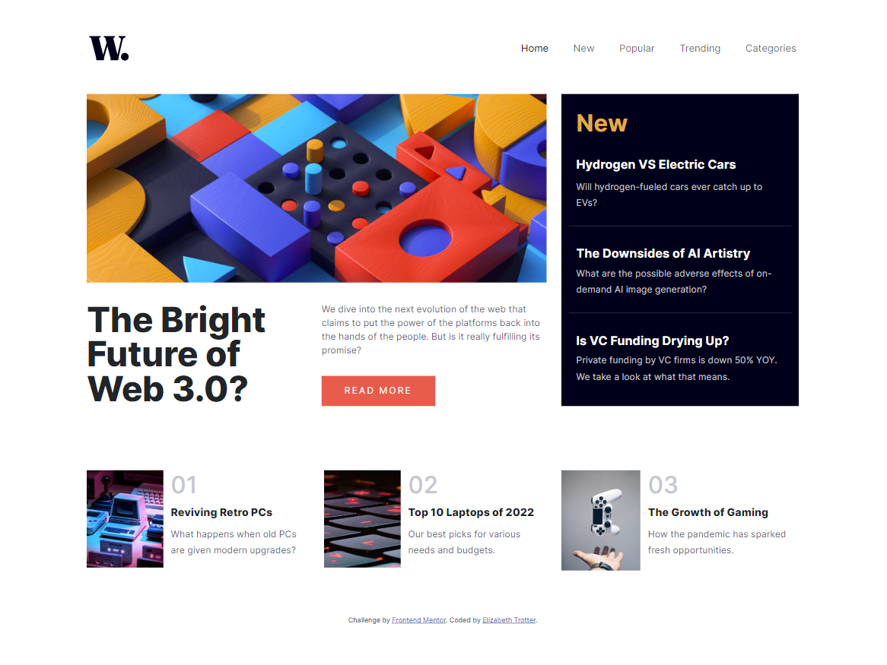

# Frontend Mentor - News homepage solution

This is a solution to the [News homepage challenge on Frontend Mentor](https://www.frontendmentor.io/challenges/news-homepage-H6SWTa1MFl). Frontend Mentor challenges help you improve your coding skills by building realistic projects. 

## Table of contents

- [Overview](#overview)
  - [The challenge](#the-challenge)
  - [Screenshot](#screenshot)
  - [Links](#links)
- [My process](#my-process)
  - [Built with](#built-with)
  - [What I learned](#what-i-learned)
  - [Peer review](#peer-review)

## Overview

### The challenge

Users should be able to:

- View the optimal layout for the interface depending on their device's screen size
- See hover and focus states for all interactive elements on the page

### Screenshot

### Links

- Live Site URL: [CLICK HERE](https://news-homepage-main-rouge.vercel.app/)

## My process

### Built with

- Semantic HTML5 markup
- CSS custom properties
- Flexbox
- Mobile-first workflow
- Bootstrap 5

### What I learned

**Bootstrap Breakpoints**

Core concepts:
- Breakpoints are the building blocks of responsive design & you use them to control when your layout can be adapted at a particular viewport or device size
- Use media queries to architect your CSS by breakpoint. Media queries are a feature of CSS that allow you to conditionally apply styles based on a set of browser & operating system parameters. We most commonly use min-width in our media queries.
- Mobile first, responsive design is the goal. Bootstrap’s CSS aims to apply the bare minimum of styles to make a layout work at the smallest breakpoint, & then layers on styles to adjust that design for larger devices. This optimizes the CSS, improves rendering time, & provides a greater experience for visitors.

**Bootstrap Grid System**

How they work:
- Columns build on the grid’s flexbox architecture. Flexbox means we have options for changing individual columns & modifying groups of columns at the row level. You choose how columns grow, shrink, or otherwise change.
- When building grid layouts, all content goes in columns. The hierarchy of Bootstrap’s grid goes from `container` to `row` to `column` to your content. On rare occasions, you may combine content and column, but be aware there can be unintended consequences.
- Bootstrap includes predefined classes for creating fast, responsive layouts. With six breakpoints and a dozen columns at each grid tier, we have dozens of classes already built for you to create your desired layouts. This can be disabled via Sass if desired.

**Boostrap Gutters**

- Gutters are the padding between your columns, used to responsively space and align content in the Bootstrap grid system.

### Peer review

**Name:** Caleb Sylvia **Date/ Time:** 2/6/2024 10:57 AM
**Comment(s):** Site looks exactly like the protype and full responsive. Very clean code nice and simple great job! Only suggestion is making sure the button for the "READ MORE" has some more padding within so the background is bigger to match prototype.
